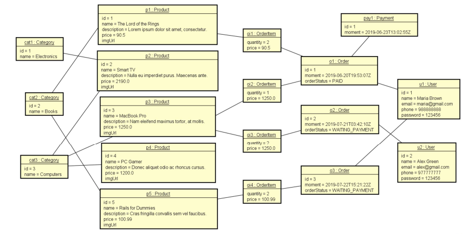

<h1 align= "center">Shop - Web Service</h1>  
 
## About the project
The project represents the purchasing logic of a store, It is a REST API, contains layered pattern, server communication, HTTP protocol. It is made in Spring Boot and database with PostgreSQL. 

It was heavily used exception handling with ExcpetionHandlers and annotations like ControllerAdvice to handle exceptions centrally. The project was taught by the professor, [Nélio Alves](https://github.com/acenelio) in the complete Java course.

 

## Class Diagram

  

 

Here I learned about the association class and that it would insert new attributes, such as price and quantity, for each order item, which would make it easier to store detailed information about each specific order item while maintaining the association between the product and the order. ⬇

  

 

And also that the OrderItem class needed a class to be the primary key of two foreign keys making many-to-many relationship and then in the OrderItem constructor put the attributes by the OrderItemPK setter. ⬇

  

 

## Object Diagram

  

 

## Layer Pattern

  

 

## Technologies used
- Java
- Spring Boot
- Maven
- JPA/Hibernate
- PostgreSQL
- H2 database

## Conclusion
This project was very important for learning about exceptions, with the help of the videos that the teacher made, I could better understand how to correctly handle exceptions with annotations that manage exceptions in an easier way and also controlling the exception status by putting a specific message for each error. 

I also saw how the relationship of an association class works and the logic of having a class serving as the primary key in the relationship. 

And finally it made me want to learn more about diagrams, because the ease that a project becomes when it has a good diagram is visible and that a programmer should understand and know how to create structural diagrams and understand behavioral diagrams.
